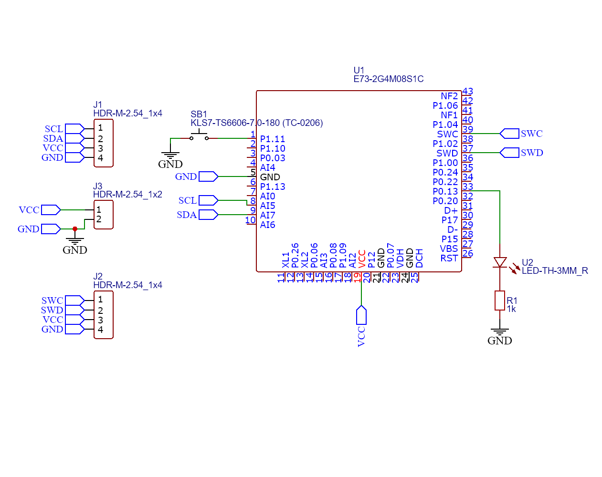

# Nordic DIY Zigbee Sensor

A practical **Zigbee Sleepy End Device** example built on **nRF52840** with a **BME280** sensor.

This repository contains a working Zigbee device example based on the **E73-2G4M08S1C** module, developed with **nRF Connect SDK (zigbee-R23)** in **VS Code** using the **nRF Connect** extension.

**Device schematic:**

## Implemented clusters

The project uses the following clusters:

- power configuration
- temperature measurement
- relative humidity measurement
- pressure measurement

The sensor used in this project is **BME280**.

## Project purpose

This project can be used as a template for further **Zigbee** development with **nRF Connect SDK**.  
It may serve as a good starting point for building your own **nRF52840** based sensor.

## Where to look for Zigbee clusters

The list of available clusters can be found in:

`Your_zigbeeSDK\nrfxlib\zboss\production\include\zcl\zb_zcl_common.h`

Descriptions of specific clusters can be found in:

`Your_zigbeeSDK\nrfxlib\zboss\production\include\zcl\`

## Extra

The repository also includes an external converter for **Zigbee2MQTT**.

---

A clean and practical Zigbee sensor example for nRF52840, built without unnecessary magic.